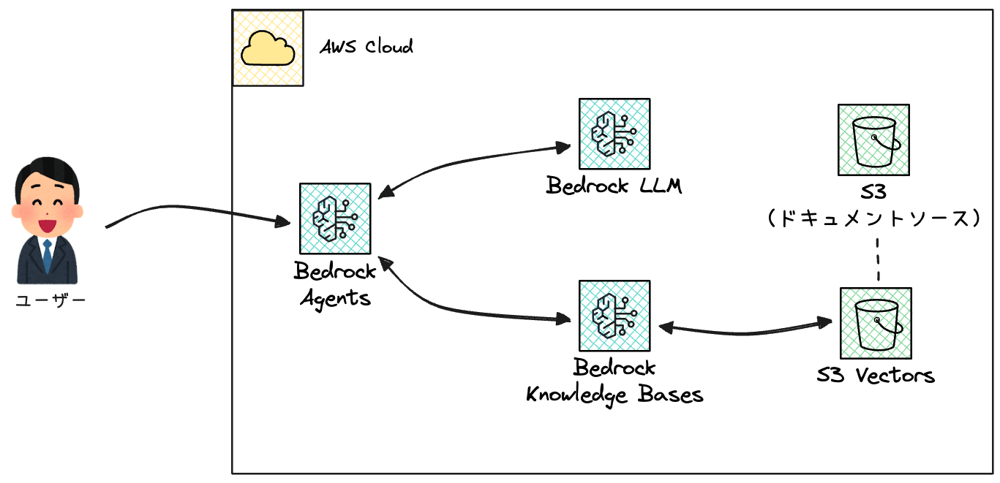
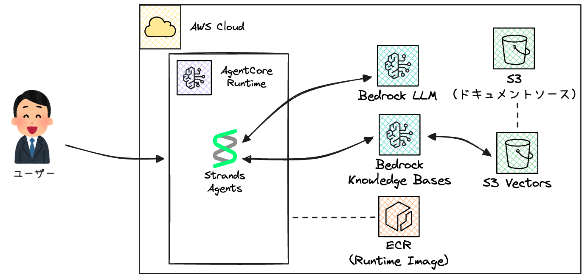

# Tortoise AI Agent

リクガメに詳しいAIエージェントをAWS上に構築するプロジェクトです。

S3 Vectors、Bedrock Knowledge Bases、Bedrock Agents、およびBedrock AgentCoreを使用して、リクガメの飼育知識を持つAIエージェントを構築します。

## アーキテクチャ

### Bedrock Agentsパターン



### Bedrock AgentCoreパターン



## 前提条件

- Terraform >= 1.5.0
- AWS CLI設定済み
- Python 3.11以上
- S3 VectorsがGAとなっているリージョン

## ディレクトリ構成

```
tortoise-ai-agent/
├── terraform/
│   ├── 01-bedrock-agents/      # Bedrock Agentsパターン
│   │   ├── *.tf                # Terraform設定ファイル
│   │   └── scripts/            # Python呼び出しスクリプト
│   └── 02-bedrock-agentcore/   # AgentCoreパターン
│       ├── *.tf                # Terraform設定ファイル
│       └── docker/             # Strands Agentsコンテナ
└── documents/
    └── tortoise-knowledge/     # リクガメ知識ドキュメント
```

## Terraform変数

| 変数名 | デフォルト | 説明 |
|--------|-----------|------|
| `aws_region` | ap-northeast-1 | AWSリージョン |
| `project_name` | tortoise-ai-* | プロジェクト名 |
| `foundation_model_id` | apac.anthropic.claude-3-5-sonnet-* | 基盤モデル |
| `agentcore_runtime_image_tag` | "" | ECRイメージタグ (B専用) |

## 作成手順

### Pattern A: Bedrock Agentsパターン

シンプルなBedrock Agentsを使用するパターンです。

### A-1. インフラをデプロイ

```bash
cd terraform/01-bedrock-agents
terraform init && terraform apply
```

### A-2. ドキュメントをS3にアップロード

```bash
BUCKET=$(terraform output -json s3_documents_bucket | jq -r '.name')
aws s3 sync ../../documents/tortoise-knowledge/ s3://${BUCKET}/tortoise-knowledge/
```

### A-3. Knowledge Baseを同期

```bash
KB_ID=$(terraform output -json knowledge_base | jq -r '.id')
DS_ID=$(terraform output -json data_source | jq -r '.id')

aws bedrock-agent start-ingestion-job --knowledge-base-id ${KB_ID} --data-source-id ${DS_ID}

# ジョブの状態を確認 (STATUSがCOMPLETEになるまで待機)
aws bedrock-agent list-ingestion-jobs --knowledge-base-id ${KB_ID} --data-source-id ${DS_ID}
```

### A-4. Knowledge Baseに直接クエリする

```bash
KB_ID=$(terraform output -json knowledge_base | jq -r '.id')
MODEL_ARN=$(terraform output -json foundation_model | jq -r '.arn')

aws bedrock-agent-runtime retrieve-and-generate \
  --input '{"text": "初心者におすすめのリクガメを教えてください。"}' \
  --retrieve-and-generate-configuration '{
    "type": "KNOWLEDGE_BASE",
    "knowledgeBaseConfiguration": {
      "knowledgeBaseId": "'${KB_ID}'",
      "modelArn": "'${MODEL_ARN}'"
    }
  }'
```

### A-5. Pythonスクリプトでエージェントを呼び出す

```bash
terraform output -raw env_file > scripts/.env && cd scripts
python3 -m venv .venv && source .venv/bin/activate && pip install -r requirements.txt

# エージェントに質問
python invoke_agent.py "初心者におすすめのリクガメを教えてください。"

# インタラクティブモード
python invoke_agent.py -i
```

---

### Pattern B: Bedrock AgentCoreパターン

カスタムStrands Agentsエージェントをデプロイするパターンです。

### B-1. 基本インフラをデプロイ

```bash
cd terraform/02-bedrock-agentcore
terraform init && terraform apply
```

### B-2. ドキュメントをS3にアップロード

```bash
BUCKET=$(terraform output -json s3_documents_bucket | jq -r '.name')
aws s3 sync ../../documents/tortoise-knowledge/ s3://${BUCKET}/tortoise-knowledge/
```

### B-3. Knowledge Baseを同期

```bash
KB_ID=$(terraform output -json knowledge_base | jq -r '.id')
DS_ID=$(terraform output -json data_source | jq -r '.id')

aws bedrock-agent start-ingestion-job --knowledge-base-id ${KB_ID} --data-source-id ${DS_ID}

# ジョブの状態を確認 (STATUSがCOMPLETEになるまで待機)
aws bedrock-agent list-ingestion-jobs --knowledge-base-id ${KB_ID} --data-source-id ${DS_ID}
```

### B-4. Dockerイメージをビルド & プッシュ

> **Note**: AgentCoreはARM64アーキテクチャのみサポート

```bash
cd docker
ECR_URL=$(cd .. && terraform output -json agentcore_runtime_ecr | jq -r '.repository_url')

# ビルド (docker-buildx必須: brew install docker-buildx)
docker-buildx create --use --name agentcore-builder 2>/dev/null || true
docker-buildx build --platform linux/arm64 -t tortoise-agentcore-runtime --load .

# プッシュ
aws ecr get-login-password --region ap-northeast-1 | docker login --username AWS --password-stdin ${ECR_URL%%/*}
docker tag tortoise-agentcore-runtime:latest ${ECR_URL}:latest
docker push ${ECR_URL}:latest
```

### B-5. Runtime & Endpointをデプロイ

```bash
cd ../
terraform apply -var="agentcore_runtime_image_tag=latest"
```

### B-6. エンドポイントをテスト

```bash
RUNTIME_ARN=$(terraform output -json agentcore_runtime | jq -r '.runtime_arn')
aws bedrock-agentcore invoke-agent-runtime \
  --agent-runtime-arn ${RUNTIME_ARN} \
  --payload fileb://<(echo '{"prompt": "初心者におすすめのリクガメを教えてください。"}') \
  --content-type application/json \
  /dev/stdout | jq -r '.response'
```
